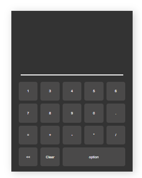
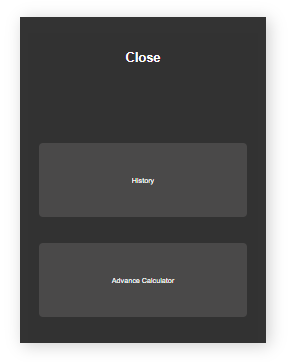
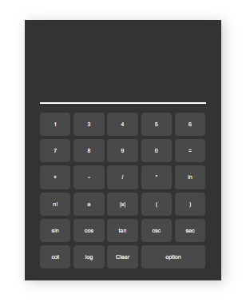

<h1>javascript calculatore </h1>

this calculatore created by javascript and html css

<h4>  ·  <a href="https://github.com/hussainsarwari/html-css-js-calculator.github.io/blob/master/README.md"> Documentation </a>  ·  <a href="https://github.com/hussainsarwari/html-css-js-calculator.github.io/issues"> Report Bug </a>  ·  <a href="https://github.com/hussainsarwari/html-css-js-calculator.github.io/issues"> Request Feature </a> </h4>

# :notebook_with_decorative_cover: Table of Contents

- [About the Project](#star2-about-the-project)
- [features](#star2-features)
- [images](#camera-images)
- [Contact](#handshake-contact)

## :star2: About the Project
i do this project for learn and practice js and it is not complete yet,  i don't finish the history and and advace calculator section 😧 .
## :star2: features
1: sample calculatore. 
2: history section. 
3:advace calculaator 
## :camera: images

## :wave: Contributing

Contributions are always welcome!

see `contributing.md` for ways to get started

### :scroll: Code of Conduct

Please read the [Code of Conduct](html-css-js-calculator.github.io/blob/master/CODE_OF_CONDUCT.md)

## :handshake: Contact

Mohammad Hussain Sarwari - - sarwarihussain7@gmail.com

Project Link: [html-css-js-calculator.github.io](html-css-js-calculator.github.io)
